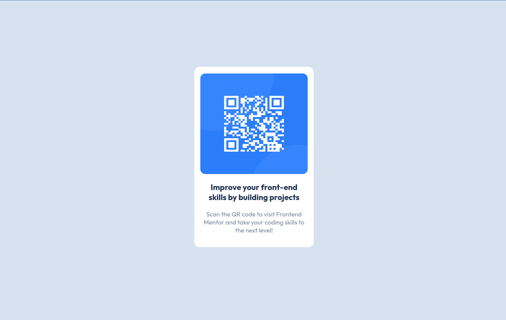

# Frontend Mentor - QR code component solution

This is a solution to the [QR code component challenge on Frontend Mentor](https://www.frontendmentor.io/challenges/qr-code-component-iux_sIO_H). Frontend Mentor challenges help you improve your coding skills by building realistic projects. 

## Table of contents

- [Overview](#overview)
  - [Screenshot](#screenshot)
  - [Links](#links)
  - [Built with](#built-with)
  - [Installation](#installation)

## Overview

### Screenshot

### Links

- Solution URL:
- Live Site URL: [Live Demo](https://ahmedgamal2212.github.io/qr-code-component/)

### Built with

- Semantic HTML5 markup
- CSS
- Flexbox
- Mobile-first workflow

### Installation

To run this project locally, you need to have Node.js and npm installed on your machine. Then, follow these steps:

1. Clone this repository: `git clone https://github.com/AhmedGamal2212/qr-code-component.git`
2. Open the `index.html` in your broswer